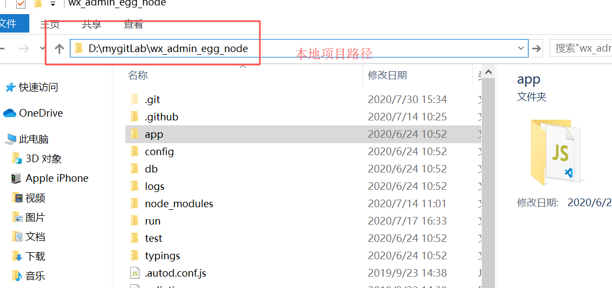

# auto-deploy


## 项目简介

> 该项目是基于`node`实现，对简单前端工程实现自动化部署至远端服务器指定目录。

## 使用

Tip: 请确保已安装node、npm
```bash
npm install # 安装依赖
npm run deploy # 本地运行
```

## 示例
**1. 待部署工程本地完成打包构建**



**2. 确定远端部署目录及发布文件夹**


**3. 修改配置**

config.js

```
  {
    name: 'wx_admin_egg_node',
    ssh: {
      host: '11.11.11.11',
      port: 22,
      username: 'root',
      password: '',  
      privateKey: 'D:/mygitLab/lbr2', // ssh私钥(不使用此方法时请勿填写， 注释即可)
      passphrase: '' // ssh私钥对应解密密码(不存在设为''即可)
    },
    projectType:'node', //项目类型 node的项目就不打包node_modules目录
    targetDir: 'D:/mygitLab/wx_admin_egg_node', // 目标压缩目录(可使用相对地址)
    targetFile: 'dist.zip', // 目标文件
    openCompress: true, // 是否开启本地压缩
    openBackUp: true, // 是否开启远端备份
    deployDir: '/www/wwwroot' + '/', // 远端目录
    releaseDir: 'wx_admin_egg_node', // 发布目录
    command:'cnpm i;npm run stop;npm run start:prod;', //上传完毕执行的命令、脚本
  }
```

**4. 运行自动化部署**

运行npm run deploy


**5. 查看远端效果**


**6. 再次部署 原目录已备份（开启远端备份生效）**


## 配置文件说明
```js
/*
config.js
说明：
  请确保解压后的文件目录为dist
  🎉现已支持添加多个配置信息，自动化部署时支持选择配置信息运行
  🎉现已支修改服务器连接端口，支持ssh私钥及解密密码连接（ps：不使用此方法时，请注释privateKey）
  🎉现已更新模块引用逻辑，远端备份时间格式改为 `yyyy-MM-dd_HH:mm:ss`
*/

const config = [
  {
    name: 'wx_admin_web',
    ssh: {
      host: '11.11.11.11',  //服务器地址
      port: 22,   //服务器端口
      username: 'root',  //服务器管理员账号
      password: '',    // 服务器密码，如果使用秘钥登录，密码为空即可。
      privateKey: 'D:/mygitLab/lbr2', // ssh私钥(不使用此方法时请勿填写， 注释即可)
      passphrase: '' // ssh私钥对应解密密码(不存在设为''即可)
    },
    projectType:'',  //项目类型 node的项目就不打包node_modules目录，为空就是纯前端项目
    targetDir: 'D:/mygitLab/wx_admin_web/dist', // 目标压缩目录(可使用相对地址)
    targetFile: 'dist.zip', // 目标文件
    openCompress: true, // 是否开启本地压缩
    openBackUp: true, // 是否开启远端备份
    deployDir: '/www/wwwroot' + '/', // 远端目录
    releaseDir: 'wx_admin_web' // 发布目录
  },
  {
    name: 'wx_admin_egg_node',
    ssh: {
      host: '11.11.11.11',
      port: 22,
      username: 'root',
      password: '',  
      privateKey: 'D:/mygitLab/lbr2', // ssh私钥(不使用此方法时请勿填写， 注释即可)
      passphrase: '' // ssh私钥对应解密密码(不存在设为''即可)
    },
    projectType:'node', //项目类型 node的项目就不打包node_modules目录
    targetDir: 'D:/mygitLab/wx_admin_egg_node', // 目标压缩目录(可使用相对地址)
    targetFile: 'dist.zip', // 目标文件
    openCompress: true, // 是否开启本地压缩
    openBackUp: true, // 是否开启远端备份
    deployDir: '/www/wwwroot' + '/', // 远端目录
    releaseDir: 'wx_admin_egg_node', // 发布目录
    command:'cnpm i;npm run stop;npm run start:prod;', //上传完毕执行的命令、脚本
  }
]
```
